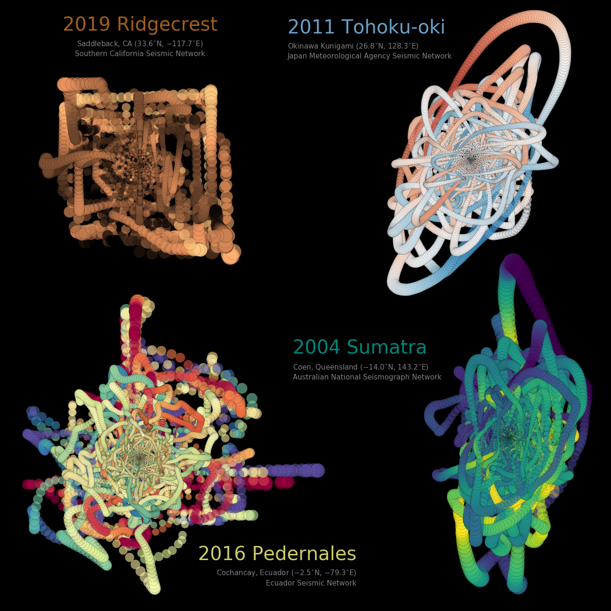

# seismoArt

<i>Visualising earthquakes through their ground motions</i>

The ground shaking caused by earthquakes is recorded by seismometers as three independent components: north-south (N), east-west (E), and up-down (Z). The `seismo_art.ipynb` Notebook visualises the 2011 Tohoku-oki earthquake by plotting the horizontal components (N vs. E), and encoding the Z component by colour. In a way, this is similar to putting a pencil on a piece of paper, and shaking that paper left-right etc. while keeping the pencil fixed. If the paper moves vertically up-down, you press down harder and the thickness of your line changes (here represented by the colours).
